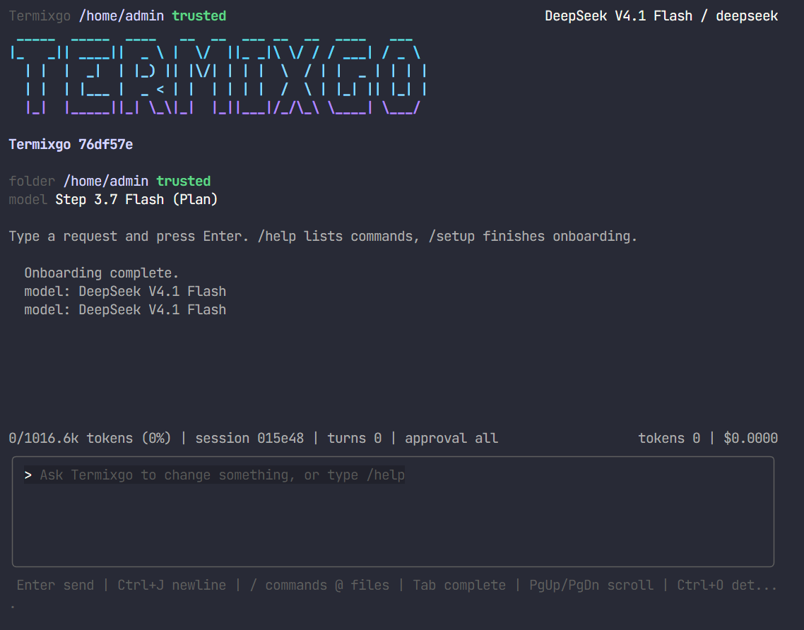

# Termixgo

[](https://github.com/99apps-id/termixgo/actions/workflows/ci.yml)
[](https://github.com/99apps-id/termixgo/actions/workflows/release.yml)
[](https://go.dev)
[](#install)
[](LICENSE)

Termixgo is a coding agent that runs entirely in your terminal. No web view, no
browser, no separate runtime. One compiled binary, your own API keys, and
everything the agent does printed as terminal output.

```
 _____  _____  ____   __  __  ___ __  __  ____   ___
|_   _|| ____||  _ \ |  \/  ||_ _|\ \/ / / ___| / _ \
  | |  |  _|  | |_) || |\/| | | |  \  / | |  _ | | | |
  | |  | |___ |  _ < | |  | | | |  /  \ | |_| || |_| |
  |_|  |_____||_| \_\|_|  |_||___|/_/\_\ \____| \___/
```

- Runs on Windows, Linux and macOS from a single static binary, cross-compiled
  and released for amd64 and arm64.
- Written in Go 1.26 with Bubble Tea. The idle footprint stays well under the
  100 MB the project targets, so a 2 GB machine is comfortable.
- Bring your own key (BYOK). Keys are stored locally and never leave your
  machine except to call the provider you chose.
- Streams what the agent is doing: thinking, reasoning, each tool call, and the
  command output behind it.
- Optional Telegram companion, so you can keep a run going from your phone.

## Screenshot



Termixgo running over SSH on a Linux VPS. The header names the workspace and the
active model, the transcript shows the onboarding summary, and the status line
keeps the context usage, the session id and the session spend in view.

## Table of contents

- [Features](#features)
- [Screenshot](#screenshot)
- [Install](#install)
- [Quick start](#quick-start)
- [The terminal UI](#the-terminal-ui)
- [Slash commands](#slash-commands)
- [Configuration](#configuration)
- [Providers](#providers)
- [OAuth logins](#oauth-logins)
- [Tools](#tools)
- [Orchestration pipelines](#orchestration-pipelines)
- [Trust and approval](#trust-and-approval)
- [Memory and skills](#memory-and-skills)
- [MCP servers](#mcp-servers)
- [Telegram companion](#telegram-companion)
- [Run as a 24/7 assistant](#run-as-a-247-assistant)
- [Scheduled jobs and heartbeat](#scheduled-jobs-and-heartbeat)
- [Cost, budgets and plans](#cost-budgets-and-plans)
- [Security](#security)
- [Where state lives](#where-state-lives)
- [CLI reference](#cli-reference)
- [Reliability](#reliability)
- [Development](#development)
- [Architecture](#architecture)
- [Releasing](#releasing)
- [Documentation map](#documentation-map)
- [License](#license)

## Features

- **A real agent loop.** Think, call tools, read the result, repeat, bounded per
  turn so a single reply cannot spend forever.
- **Fifty-plus built-in tools.** Filesystem, search, exact edits, patching, shell
  and background processes, git, GitHub pull requests, orchestration pipelines,
  web search and fetch, vision, memory, skills, todos and subagents.
- **Any provider.** OpenAI, Anthropic, Google and dozens more, including local
  servers and any OpenAI-compatible endpoint you point it at.
- **Subscriptions as first-class providers.** Qwen Cloud Token Plan and StepFun
  Step Plan are selectable like any other provider, billed in credits.
- **Trust that means something.** A fresh folder is untrusted and asks before it
  writes or runs; a trusted folder works without interrupting you.
- **Composable.** `termixgo run "<prompt>"` falls back to plain streaming without
  a TTY, so it works in pipes and CI and exits non-zero when a turn failed.

## Install

### Windows

Download `Termixgo-<version>-windows-amd64-installer.zip` from the
[latest release](https://github.com/99apps-id/termixgo/releases/latest), extract
it anywhere, and double-click `INSTALL.bat`. It installs to
`%LOCALAPPDATA%\Programs\Termixgo`, adds that directory to the user PATH and
registers an uninstaller. Open a new terminal afterwards so it picks up the PATH
change.

### Linux and macOS

```sh
tar xzf termixgo-<version>-linux-amd64.tar.gz
cd termixgo-<version>-linux-amd64 && ./install.sh
exec "$SHELL" -l
```

The script installs to `~/.local/bin` and adds it to the PATH in `~/.bashrc`,
`~/.zshrc` or the fish config. No root is needed, which is what makes it work on
a VPS.

### From source

Requires Go 1.26 or newer.

```sh
git clone https://github.com/99apps-id/termixgo.git
cd termixgo
make build          # or: go build -o bin/termixgo ./cmd/termixgo
./bin/termixgo
```

Cross-compile for every platform with `make cross`.

## Quick start

On first use Termixgo opens the onboarding wizard:

1. Pick a provider.
2. Paste an API key. It is stored in `~/.termixgo/secrets.json`, readable only
   by your account, and is never displayed again.
3. Pick the default model for that provider.
4. Optionally connect a Telegram bot.

The wizard is available any time with `/setup`. To configure from a shell:

```sh
termixgo secret anthropic                 # prompts, input hidden
termixgo model claude-sonnet-5
termixgo endpoint openai-compatible https://my-server/v1
termixgo trust on                         # trust this folder
termixgo doctor                           # show what is configured
```

Then type a request and press Enter:

```
> add a /health endpoint and a test for it
> + Reading src/server/routes.go
> + Grepping "/health"
> + Editing src/server/routes.go
> + Wrote src/server/routes_test.go
> + Running pnpm run test
  + Ran pnpm run test (4231ms)
Added GET /health returning 200 with an uptime field, and a test that asserts
the status code and body shape. The suite passes: 41 tests, 0 failures.
```

## The terminal UI

| Line | Meaning |
| --- | --- |
| `Thinking...` | the model's reasoning is streaming in |
| `Reasoned for 4s` | the reasoning block finished, with its duration |
| `> Reading foo.go` | a tool call is running |
| `+ Read foo.go (12ms)` | the tool finished |
| `x Running ...` | the tool failed, with the output in the transcript |
| `[x] Fix the parser` | the plan, updated as work progresses |
| `    ... [tool output clipped]` | the tool result is longer than the transcript cap |

Keys:

| Key | Action |
| --- | --- |
| `Enter` | send |
| `Ctrl+J` / `Alt+Enter` | insert a newline |
| `Tab` | complete a slash command or an `@file` mention |
| `Ctrl+O` | show or hide tool and reasoning details |
| `Ctrl+Y` | copy the newest answer to the clipboard |
| `Esc` | stop the running turn, then clear the input |
| `PgUp` / `PgDn`, wheel | scroll the transcript |
| `Ctrl+C` | quit |

While a turn runs, `Enter` steers it: the message is folded into the running
turn at its next step so you can change course without stopping it. A slash
command typed mid-turn is queued and runs when the turn ends.

## Slash commands

| Command | What it does |
| --- | --- |
| `/model [id]` | show or switch the model (no argument opens a picker) |
| `/setup` | onboarding: provider key, model, skills, Telegram |
| `/help` | every command and key binding |
| `/copy [last\|all]` | copy the newest answer, or the whole transcript, over OSC 52 |
| `/new` | start a new session |
| `/sessions [list\|search\|rename\|delete\|export]` | manage saved sessions |
| `/sessions export <id> [--format markdown|jsonl]` | export a session |
| `/stop` | stop the running turn |
| `/status` | workspace, model, plan and token status |
| `/trust [on\|off]` | show or change folder trust |
| `/approval [ask\|edits\|all\|plan]` | when a tool waits for you |
| `/harness [id]` | how hard the agent plans and verifies, and the step budget |
| `/plan` | show the current task plan |
| `/tools` | list the tools the agent can call |
| `/mcp [reload]` | show the MCP servers and the tools they add |
| `/skills [list\|reload\|proposals\|apply\|reject]` | list or manage skills |
| `/memory` | show what the agent has learned |
| `/telegram [setup\|on\|off\|status\|pair]` | manage the companion bot |
| `/cron [list\|add\|remove\|on\|off\|run]` | schedule assistant jobs |
| `/heartbeat [on\|off\|<interval>]` | periodic self-check for a 24/7 assistant |
| `/audit [count]` | show recent audited actions |
| `/worker [list\|start]` | run a background coding worker |
| `/init` | generate a `TERMIXGO.md` for the project |
| `/cost` | token usage and estimated spend for this session |
| `/ps [kill <handle>]` | list background processes, or stop one |
| `/checkpoint [list\|<message>]` | save a working-tree snapshot |
| `/rewind [ref]` | restore the newest checkpoint, undoing later edits |
| `/worktree [list\|add\|remove]` | git worktrees, for a second task in parallel |
| `/exit` | quit |

Type `/` on its own and press `Enter` to open the command menu. The menu never
appears while you are typing, so a slash inside a path or a sentence is plain
text: `c:/project` and `/home/you` stay typeable, and the request is sent as
written.

A command with a fixed set of arguments offers them as a menu. Type `/approval`
or `/harness` and press `Enter` and the modes are listed with what each one
does; `/approval` also keeps a `(no argument)` row that prints the current
policy. The same menu opens with `Tab`. A value that only starts an argument,
such as `delete` for `/sessions`, fills the composer and waits for the rest.

Slash commands are local: they never reach the model as text, so `/cost` while a
turn is running reports the spend instead of asking the agent about it.

A turn runs at a time across the whole app, acquired with `runMu.TryLock`. A
second caller gets `app.ErrBusy`; it is never queued, because a queued caller
looks hung to the operator.

## Configuration

The non-secret settings live in `~/.termixgo/config.json`. Every key is optional.

```json
{
  "version": 1,
  "defaultModel": "claude-sonnet-5",
  "approvalMode": "all",
  "showReasoning": true,
  "language": "en",
  "maxSteps": 300,
  "harnessProfile": "critical",
  "toolSearchEnabled": false,
  "costBudgetUsd": 2.0,
  "systemPrompt": "",
  "baseUrls": { "openai-compatible": "https://my-server/v1" },
  "modelOverrides": {},
  "modelPricing": { "my-model": { "inputPerMillion": 3.0, "outputPerMillion": 9.0 } },
  "subagentModels": { "code-review": "antigravity-gemini-3.8-flash" },
  "subagentFallbacks": ["deepseek-v4-pro", "qwen-token-plan/qwen3.8-flash", "stepfun-plan/step-3.7-flash"],
  "trustedFolders": [],
  "alwaysAllowedTools": [],
  "mcpServers": [],
  "telegram": { "enabled": false }
}
```

| Key | Purpose |
| --- | --- |
| `defaultModel` | the model a new session starts with |
| `approvalMode` | `ask`, `edits`, `all` or `plan` |
| `maxSteps` | the whole per-turn ceiling: the agent pauses after this many steps and continues when you reply |
| `harnessProfile` | `balanced`, `plan_briefly`, `verify_before_finish`, `terminal_first`, `shorter_loop`, `no_todo`, `autonomous` or `critical` |
| `toolSearchEnabled` | load the ecosystem tools on demand instead of every request |
| `costBudgetUsd` | stop the run once estimated session spend passes this |
| `baseUrls` | a custom base URL per provider id |
| `modelOverrides` | map a stable model id to the id sent on the wire |
| `modelPricing` | give an unpriced model a price so a budget can fire |
| `mcpServers` | MCP servers to start with a session |
| `workerCommands` | override a background worker's argv, keyed by worker id |
| `subagentModels` | run a subagent role (`explore`, `general`, `builder`, `code-review`, `security`) on another model, as a catalogue id, `provider:model` or `provider/model` |
| `subagentFallbacks` | ordered subagent model chain tried when a provider has no credential or runs out of quota; when set it is the complete set, so a subagent never falls back to the active model |
| `heartbeat` | `{ "enabled": true, "interval": "30m" }` for the periodic self-check |

Set `TERMIXGO_HOME` to move the whole state directory, which is useful for tests
and throwaway profiles.

## Providers

Any provider is selectable with `/model` or `termixgo model <id>`. A model the
catalogue does not list is still usable by typing its id, and a key can come from
the environment for CI.

| Provider | id | Environment variable |
| --- | --- | --- |
| OpenAI | `openai` | `OPENAI_API_KEY` |
| Anthropic | `anthropic` | `ANTHROPIC_API_KEY` |
| Google Gemini | `google` | `GEMINI_API_KEY`, `GOOGLE_API_KEY` |
| xAI Grok | `xai` | `XAI_API_KEY` |
| DeepSeek | `deepseek` | `DEEPSEEK_API_KEY` |
| StepFun | `stepfun` | `STEPFUN_API_KEY`, `STEPFUN_CN_API_KEY` |
| StepFun Plan | `stepfun-plan` | `STEPFUN_PLAN_API_KEY` |
| Moonshot Kimi | `moonshot` | `MOONSHOT_API_KEY`, `KIMI_API_KEY` |
| MiniMax | `minimax` | `MINIMAX_API_KEY` |
| Zhipu GLM | `zhipu` | `ZHIPU_API_KEY`, `GLM_API_KEY` |
| Alibaba Qwen | `qwen` | `DASHSCOPE_API_KEY`, `QWEN_API_KEY` |
| Qwen Cloud Token Plan | `qwen-token-plan` | `QWEN_TOKEN_PLAN_API_KEY` |
| Mistral | `mistral` | `MISTRAL_API_KEY` |
| Baidu Qianfan | `baidu` | `QIANFAN_API_KEY`, `BAIDU_API_KEY` |
| Volcengine Ark (Doubao) | `volcengine` | `ARK_API_KEY`, `VOLCENGINE_API_KEY` |
| iFlow | `iflow` | `IFLOW_API_KEY` |
| Groq | `groq` | `GROQ_API_KEY` |
| Cerebras | `cerebras` | `CEREBRAS_API_KEY` |
| SambaNova | `sambanova` | `SAMBANOVA_API_KEY` |
| Fireworks | `fireworks` | `FIREWORKS_API_KEY` |
| Together AI | `together` | `TOGETHER_API_KEY` |
| DeepInfra | `deepinfra` | `DEEPINFRA_API_KEY` |
| Novita AI | `novita` | `NOVITA_API_KEY` |
| SiliconFlow | `siliconflow` | `SILICONFLOW_API_KEY` |
| Nebius | `nebius` | `NEBIUS_API_KEY` |
| NVIDIA NIM | `nvidia` | `NVIDIA_API_KEY`, `NVIDIA_NIM_API_KEY` |
| Hyperbolic | `hyperbolic` | `HYPERBOLIC_API_KEY` |
| Lambda Labs | `lambda` | `LAMBDA_API_KEY` |
| Lepton AI | `lepton` | `LEPTON_API_KEY` |
| Chutes | `chutes` | `CHUTES_API_KEY` |
| Hugging Face Router | `huggingface` | `HF_TOKEN`, `HUGGINGFACE_API_KEY` |
| OpenRouter | `openrouter` | `OPENROUTER_API_KEY` |
| Vercel AI Gateway | `vercel` | `AI_GATEWAY_API_KEY` |
| GitHub Models | `github` | `GITHUB_MODELS_TOKEN`, `GITHUB_TOKEN` |
| Kilo Code | `kilocode` | `KILOCODE_API_KEY` |
| Venice AI | `venice` | `VENICE_API_KEY` |
| Blackbox AI | `blackbox` | `BLACKBOX_API_KEY` |
| Perplexity | `perplexity` | `PERPLEXITY_API_KEY` |
| Cohere | `cohere` | `COHERE_API_KEY`, `CO_API_KEY` |
| AI21 Labs | `ai21` | `AI21_API_KEY` |

Providers whose URL carries an account or resource id have no usable default and
must be pointed at a server through `baseUrls`: `cloudflare`, `azure` and
`openai-compatible`. Local servers need no key and no network: `ollama`,
`lmstudio` and `mlx`.

```sh
termixgo models --provider qwen-token-plan   # list one provider's catalogue
termixgo endpoint                            # show the custom endpoints
termixgo endpoint openai-compatible https://my-server/v1
```

### Choosing a model

- First run, and `/setup`, walks provider then model: the wizard lists the
  providers, and after you pick one it lists that provider's models. An OAuth
  provider shows "login required" and points at the login command instead of
  asking for an API key.
- `/model` opens a provider list first, limited to the providers you can use now
  (the current one, local servers, and providers with a stored key or login),
  then that provider's models. Type to filter, Enter to pick, and Esc to go back
  to the provider list.
- `/model <id>`, `termixgo model <id>` and `termixgo models [--provider id]` do
  the same from the keyboard or the shell. An id the catalogue does not list is
  still usable with `provider:id` (for example `openai:gpt-9-experimental`).

OAuth providers (see below) appear once you have logged in, and their models
work like any other. The catalogue keeps a readable local id separate from the
wire id a provider expects, so a vendor rename does not change what you type.

## OAuth logins

Some providers log in with a device code or a browser instead of an API key.
Run the login once; the token is stored in `~/.termixgo/secrets.json` (0600) and
refreshed automatically. There are two shapes:

- Device code (xAI/Grok, GitHub Copilot): the command prints a URL and a short
  code. Open the URL, enter the code and approve. The command waits and finishes
  by itself.
- Browser with a loopback callback (ChatGPT/Codex, Claude, Antigravity): the
  command opens the browser at the vendor's consent page, or prints the URL when
  it cannot. Approve there; the browser returns to a local port and the login
  completes. No code to type.

A server with no browser runs the same login. Open the printed URL on another
machine and approve; the browser cannot reach the server's `127.0.0.1`, so copy
the redirect URL from the address bar (it carries `code=` and `state=`) and
paste it back into the terminal on the server. An SSH tunnel is the alternative:
`ssh -L <port>:127.0.0.1:<port> user@server` before opening the URL lets the
browser finish the callback, which is easiest for Codex because its port is
fixed at 1455.

```sh
termixgo login xai-oauth      # xAI/Grok, device code
termixgo login openai-codex   # ChatGPT/Codex, browser + loopback callback (port 1455)
termixgo login claude-oauth   # Claude, browser + loopback callback
termixgo login antigravity    # Google Antigravity, browser + loopback callback
termixgo login github-copilot # GitHub Copilot, device code
termixgo login muse           # Meta Muse Code, device code then API-key mint
termixgo logout <provider>
```

The setup wizard runs the same check: choosing an OAuth provider shows "login
required" and points at the login command instead of asking for an API key.

Then pick a model:

```sh
termixgo model xai-oauth/grok-4.7-oauth
termixgo model openai-codex/codex-gpt-5.5
termixgo model claude-oauth/claude-oauth-sonnet-5
termixgo model antigravity/antigravity-gemini-3.8-flash
termixgo model github-copilot/copilot-gpt-5.4
termixgo model muse/muse-spark-1.3
```

### Antigravity

A full login on a machine with a browser, then pick a model and start:

```sh
termixgo login antigravity                    # opens the Google consent page
termixgo model antigravity/antigravity-gemini-3.8-flash
termixgo
```

On a headless server the same command prints the consent URL. Open it on your
own machine, approve, then paste the failed `127.0.0.1` callback URL from the
address bar back into the server terminal to finish the login.

Antigravity signs in with Google's public installed-app client, the same pair
the Antigravity IDE ships. A release build stamps that pair into the binary at
build time, from a git-ignored `.env.local` or from
`TERMIXGO_ANTIGRAVITY_CLIENT_ID` and `TERMIXGO_ANTIGRAVITY_CLIENT_SECRET`, so a
shipped build opens the browser with no prompt. The pair is never committed,
because GitHub secret scanning flags it. You can also set those two variables
at run time, and a build without the stamp asks for the pair once and stores it
in the secret file.

Antigravity keys models by an upstream id that carries the thinking tier, for
example `gemini-3.8-flash-medium`. The catalogue maps a readable local id onto
it, so choose the model from `/model` or `termixgo models` rather than typing a
wire id by hand.

These endpoints are requested by the vendors' own CLIs and are not officially
supported; a failure names the model id and the endpoint.

## Tools

The agent can call more than fifty tools. `toolSearchEnabled` keeps the
ecosystem tools out of every request and loads them on demand through
`find_tools`, which trims the schema a large toolset otherwise sends each step.

| Tool | Purpose |
| --- | --- |
| `read_file`, `list_directory` | windowed text reads, one directory level |
| `write_file`, `create_directory`, `delete_file`, `move_file` | filesystem changes |
| `edit`, `multi_edit`, `apply_patch` | exact-string edits, applied atomically |
| `grep`, `glob` | content and path search |
| `search_memory` | full-text over learned memory, the journal and the workspace (SQLite FTS5) |

| Tool | Purpose |
| --- | --- |
| `run_command` | run a shell command and stream its output |
| `run_checks` | detect and run the project's own test, lint, typecheck and build |
| `run_background`, `run_logs`, `run_wait`, `run_list`, `run_kill` | managed background processes |

| Tool | Purpose |
| --- | --- |
| `git_status`, `git_diff`, `git_log`, `git_show` | read the repository |
| `git_add`, `git_commit`, `git_branch`, `git_restore` | change the repository |
| `git_worktree` | a parallel checkout |
| `github_create_pr`, `github_get_pr`, `github_list_prs` | pull requests through `gh` |
| `github_review_pr`, `github_comment_pr`, `github_merge_pr` | review and merge a pull request |
| `checkpoint`, `rewind` | working-tree snapshots |

| Tool | Purpose |
| --- | --- |
| `todo_write`, `todo_read` | the plan |
| `remember` | append a learned fact |
| `use_skill`, `find_skill`, `install_skill`, `propose_skill` | load, install or propose skills |
| `ask_user` | ask a question when a decision cannot be made from the code |
| `think` | reason without acting |
| `subagent` | delegate a typed, self-contained task |
| `orchestrate`, `list_pipelines` | run a multi-agent pipeline |
| `code_worker` | hand a coding task to a background agent (termixgo, claude, codex, opencode) in its own worktree |

| Tool | Purpose |
| --- | --- |
| `web_fetch` | fetch a URL and reduce HTML to text; falls back to the r.jina.ai reader |
| `web_search` | search the web and return titles, URLs and snippets |
| `lookup` | weather, exchange rate, crypto price or a Wikipedia summary from a known keyless source |
| `read_image` | attach a local image so a vision model can see it |
| `find_tools` | search the toolset by keyword and load the match |

`run_command` is how the agent drives `biome`, `vitest`, `cargo clippy`,
`pytest`, `golangci-lint` and anything else your project uses; the output is
streamed into the transcript. Every MCP server you configure adds its own tools,
named `mcp_<server>__<tool>`.

**Web access.** `web_search` is keyless out of the box: it uses DuckDuckGo, then
falls back to Wikipedia and GitHub when a source is unreachable. Where an ISP
blocks DuckDuckGo by DNS, give it a keyed provider instead. A key set with
`termixgo secret tavily` (or `BRAVE_API_KEY`/`TAVILY_API_KEY`) is tried first:

```sh
termixgo secret tavily     # prompts, input hidden
termixgo secret brave
```

`web_fetch` reads a page directly and automatically retries through `r.jina.ai`
when the direct fetch is DNS-blocked or bot-blocked (a 403 or 429), so a host
your DNS blocks still reads. Pass `reader: true` to force the reader for a
JavaScript page. A search that finds nothing does not claim the machine is
offline: that message appears only when no source could be reached at all.

When the system resolver cannot resolve a host, the web tools resolve it over
DNS-over-HTTPS (Cloudflare) and connect to the resolved address, the same way a
browser escapes an ISP DNS block. This keeps keyless search working where the
router returns NXDOMAIN for DuckDuckGo.

For questions with a fixed source, `lookup` answers directly without a search:

```
lookup kind=weather query=Jakarta
lookup kind=fx from=USD to=IDR amount=100
lookup kind=crypto query=bitcoin
lookup kind=wiki query=Go programming language
```

Weather uses Open-Meteo, exchange rates use the European Central Bank feed via
Frankfurter, crypto prices use CoinGecko and summaries use Wikipedia. All are
keyless.

## Orchestration pipelines

A pipeline is a JSON file in `.termixgo/pipelines/<id>.json`. Each step runs as a
subagent, in dependency order, and a step marked `parallel` runs alongside the
others ready at the same time. `{{step.field}}` interpolates an earlier result.

```json
{
  "id": "review",
  "name": "Review the change",
  "steps": [
    { "id": "read", "type": "explore", "prompt": "Read the diff and list what changed." },
    { "id": "bugs", "type": "code-review", "prompt": "Find bugs in {{read}}", "depends_on": ["read"], "parallel": true },
    { "id": "sec", "type": "security", "prompt": "Audit {{read}}", "depends_on": ["read"], "parallel": true }
  ]
}
```

`list_pipelines` names them and `orchestrate` runs one. A step whose dependency
failed is skipped, and the result reports what completed, failed and was skipped.

### Background coding workers

`code_worker` hands a self-contained coding task to a background coding agent in
its own git worktree. It is a detached process, not a second in-process turn:
the run loop stays single-turn, the worker survives the turn that started it,
and it never edits the main tree. When it finishes, the result is announced in
the transcript and sent to the paired Telegram chat.

The worker is one of:

- `termixgo` - this same binary running `termixgo run <task>`, so it needs no
  external account and uses the model already configured here.
- `claude`, `codex` or `opencode` - an external coding CLI, which must be on
  `PATH`; a missing one is named rather than reported as a bare command error.

A native worker is marked so it cannot start another worker and recurse. The
tool is approval gated like any other command, because it runs a coding agent
with permission to write.

## Trust and approval

Termixgo treats folders as trusted or untrusted. A fresh folder is untrusted:
writes and commands ask first. You can approve once, for the session, or always.
Once a folder is trusted, the agent works without interrupting you.

`/approval` sets the policy independently of trust:

- `ask`: every write and every command waits.
- `edits`: file edits run, commands wait.
- `all`: nothing waits.
- `plan`: read, search and plan, but every mutating tool is blocked.

## Memory and skills

- **Project memory**: the first of `TERMIXGO.md`, `AGENTS.md` or `CLAUDE.md` at
  the workspace root enters the system prompt.
- **Learned memory**: `.termixgo/memory.md` per project and
  `~/.termixgo/memory.md` globally. The agent appends with the `remember` tool.
- **Skills**: `.termixgo/skills/<name>/SKILL.md` in the project, or
  `~/.termixgo/skills/<name>/SKILL.md` globally. Only the short description
  enters the prompt; the body loads on demand.

Skills are never rewritten behind your back. The `propose_skill` tool stages a
new or updated skill as a proposal instead of writing it, and the operator
applies or rejects it:

```
/skills proposals      # list staged proposals
/skills apply <id>     # write the live SKILL.md
/skills reject <id>    # drop it
```

An update records the target's hash, so applying a proposal whose target has
changed since it was staged is refused as stale rather than clobbering newer
work. Proposals live in `.termixgo/skill-proposals/` until they are resolved.

## MCP servers

Termixgo is a Model Context Protocol client over stdio. A server you configure
contributes its tools to the agent.

```json
{
  "mcpServers": [
    {
      "name": "files",
      "command": "npx",
      "args": ["-y", "@modelcontextprotocol/server-filesystem", "."]
    }
  ]
}
```

Add that to `~/.termixgo/config.json` and run `/mcp reload`. The server starts
with the session and its tools appear as `mcp_<server>__<tool>`, so
`mcp_files__read_file` always says where the call went.

A server's `env` is a place for a token such as
`GITHUB_PERSONAL_ACCESS_TOKEN`. Those values are kept in the 0600 secret file
rather than `config.json`, which has no explicit owner-only ACL on Windows; a
server's `env` written into `config.json` by an older version is moved to the
secret file on the next start.

- `/mcp` lists every server, whether it started, and how many tools it added.
- `termixgo mcp` does the same from a shell and exits non-zero when a server
  fails to start, which makes it usable in a check.
- `disabled` parks a server without deleting its command line.

Two things to know: every contributed tool is approval gated and, in an untrusted
folder, asks before it runs, though a server can lower that with a `readOnlyHint`
which is treated as a claim rather than a guarantee. And the protocol is on the
server's stdio, so a server that prints a banner on stdout will not work; its
stderr is kept and shown in the failure message.

Only stdio transport is implemented, and only `initialize`, `tools/list` and
`tools/call`.

## Telegram companion

```
/telegram setup     # paste a token, get a pairing code
/telegram status
/telegram off
```

The bot accepts `/run <prompt>`, `/stop`, `/new`, `/model`, `/status`, `/help`
and plain text. It refuses every chat until paired, and pins the owner user id
once paired. Progress is mirrored into one edited message instead of a flood.

Answers are rendered from Markdown: bold, inline code, fenced code blocks,
headings and links, converted to Telegram's HTML subset, with a plain-text
fallback if Telegram ever rejects an entity so a formatting bug cannot swallow a
reply. Pipe tables are rendered as aligned preformatted blocks, and fenced code
blocks whose info string ends with `linenos` are emitted with numbered lines.
`/model` opens a provider-and-model picker. Send a photo, optionally with a
caption as the instruction, and the agent sees it with a vision model.

`termixgo serve` verifies that a usable model is configured before it starts and
names the exact reason (a missing key, an unknown provider) if it is not. The CLI
keeps its own settings, so a custom endpoint set in another application is not
shared with it; use `termixgo endpoint` and `termixgo secret` to configure it.

To run the bot as an always-on assistant, see
[Run as a 24/7 assistant](#run-as-a-247-assistant).

## Run as a 24/7 assistant

`termixgo serve` is the headless assistant: it connects the Telegram bot, starts
the scheduler and the heartbeat, and stays up until it is stopped. Register it
with the operating system so it starts on boot and survives a closed session:

```sh
termixgo telegram on       # enable the bridge (or pair with /telegram setup)
termixgo serve             # run it in the foreground to watch the startup
termixgo service install   # systemd on Linux, launchd on macOS, schtasks on Windows
termixgo service status
termixgo service uninstall
```

What `service install` creates:

- Linux: a systemd user unit at `~/.config/systemd/user/termixgo.service` with
  `Restart=on-failure` and `RestartSec=5`, enabled with
  `systemctl --user enable --now`, plus `loginctl enable-linger` so it keeps
  running after you close the SSH session and starts at boot without a login.
- macOS: a launchd agent under `~/Library/LaunchAgents`.
- Windows: a scheduled task named `TermixgoAssistant` that starts at logon and is
  run once immediately.

Inspect and control it:

```sh
# Linux
systemctl --user status termixgo
systemctl --user restart termixgo
journalctl --user -u termixgo -f
loginctl show-user "$USER" -p Linger   # Linger=yes means boot start without login

# Windows (PowerShell)
schtasks /Query /TN TermixgoAssistant /V /FO LIST
Start-ScheduledTask -TaskName TermixgoAssistant
```

A headless server has no browser, so an OAuth login is finished by pasting the
redirect URL back (see [OAuth logins](#oauth-logins)); once the token is stored
the service refreshes it on its own. Give it work to do with
`termixgo cron` and a periodic self-check with `termixgo heartbeat`
(see [Scheduled jobs and heartbeat](#scheduled-jobs-and-heartbeat)).

## Scheduled jobs and heartbeat

A scheduled job is a saved prompt with a schedule. The `serve` scheduler runs it
on a fresh, isolated session, so it never appears in your conversation, and
sends the answer to the paired Telegram chat unless the answer is exactly
`[SILENT]`.

```sh
termixgo cron add "every 30m" build "run the tests and report failures"
termixgo cron add "cron 0 9 * * 1-5" standup "summarise what changed yesterday"
termixgo cron add "at 2026-01-02 15:04" ship "remind me to tag the release"
termixgo cron list
termixgo cron off <id>
termixgo cron run <id>       # run it once now and print the answer
```

Schedules are `every <duration>`, `at <time>`, a five-field `cron` expression
(`minute hour day month weekday`, names and macros such as `@daily` accepted),
or `@hourly`. The same commands are available inside the UI as `/cron add
every 30m :: <prompt>`.

The heartbeat is a periodic self-check for an assistant left running. It asks
the model to look for anything worth saying and answer exactly `HEARTBEAT_OK`
when there is nothing, which is dropped instead of delivered. Put a checklist
in a `HEARTBEAT.md` at the workspace root to give it something to check.

```sh
termixgo heartbeat on
termixgo heartbeat interval 2h
```

Jobs and the heartbeat run only under `termixgo serve`; a plain terminal session
is unaffected. `/heartbeat` and `/cron` show the same state from inside the UI.

## Cost, budgets and plans

The status bar and `/cost` show estimated spend for the session, from published
list prices:

```
$ /cost
Tokens: 41230 in, 8114 out, 49344 total.
Estimated spend: about $0.2457 (budget $2.00).
```

To cap a session, add a budget to `~/.termixgo/config.json`:

```json
{ "costBudgetUsd": 2.0 }
```

The run stops before the step that would pass the budget and says so:
`stopped: estimated spend reached $2.1043 of the $2.00 budget`. It never stops
silently.

Three honest caveats:

- Prices are list values in a table in `internal/provider/pricing.go`, checked
  against each vendor's published rates. Vendors change them; treat the figure as
  a budget guide, not an invoice.
- Local models (Ollama, LM Studio, MLX) report as free rather than unknown, so a
  zero next to a local model means what it says.
- A model with no recorded price reports `cost unknown for this model` and no
  budget will fire. `doctor` and `/cost` say so explicitly, and `modelPricing`
  gives such a model a price.

**Subscriptions bill in credits, not dollars.** The Qwen Cloud Token Plan and
StepFun Step Plan providers report no dollar price, the status line reads
`plan Credits`, and a `costBudgetUsd` cap does not apply to them. The plan's own
console reports the credits used.

## Security

Read [`SECURITY.md`](SECURITY.md) before running Termixgo somewhere that matters.
The short version:

- **The secret file grants access to you alone**, on every platform. On Linux
  and macOS that is mode 0600; on Windows it is an explicit ACL that replaces the
  inherited one, because `os.Chmod` only toggles the read-only attribute there.
  `termixgo doctor` reports the real state rather than assuming it.
- **There is no sandbox.** Tools run with your permissions. Folder trust and the
  approval policy are the only gates.
- **A cost cap is an estimate, not a guarantee.** It compares tokens against list
  prices and cannot fire for a model with no recorded price.
- **Keys are stored as plaintext** in the state directory, not in the OS
  keychain. `doctor` tells you who can read the file.

Report vulnerabilities privately through GitHub security advisories, not a public
issue.

## Where state lives

| Path | Contents |
| --- | --- |
| `~/.termixgo/config.json` | model, approval mode, trust list, Telegram pairing |
| `~/.termixgo/secrets.json` | provider keys and the bot token, owner-only |
| `~/.termixgo/sessions/*.json` | saved conversations, owner-only |
| `~/.termixgo/memory.md` | global learned memory |
| `~/.termixgo/cron/jobs.json` | scheduled assistant jobs |
| `~/.termixgo/audit.jsonl` | metadata-only ledger of turns and tool calls |
| `<workspace>/.termixgo/memory.md` | project learned memory |
| `<workspace>/.termixgo/skills/` | project skills |
| `<workspace>/.termixgo/skill-proposals/` | staged skill changes awaiting review |
| `<workspace>/.termixgo/worktrees.json` | tracked parallel worktrees |
| `<workspace>/.termixgo/pipelines/` | orchestration pipelines |
| `<workspace>/.termixgo/search.db` | the full-text index behind `search_memory` |
| `<workspace>/.termixgo/error-journal.jsonl` | the error journal |

## CLI reference

```sh
termixgo                        # terminal UI (setup runs on first use)
termixgo setup                  # open the onboarding wizard
termixgo run "<prompt>"         # one prompt, streamed to stdout
termixgo models [--provider id] # list the model catalogue
termixgo model [id]             # show or set the default model
termixgo endpoint [provider url]# show or set a provider custom base URL
termixgo trust [on|off]         # show or set folder trust
termixgo approval [mode]        # ask, edits, all or plan
termixgo harness [id]           # show or set the agent harness profile
termixgo mcp                    # list MCP servers and their tools
termixgo secret <provider> [key] # store a provider API key
termixgo login <provider>       # OAuth login: xai-oauth, openai-codex, claude-oauth, antigravity, github-copilot, muse
termixgo logout <provider>      # drop a stored OAuth login
termixgo telegram [status|on|off]
termixgo cron [list|add|remove|on|off|run]
termixgo heartbeat [status|on|off|interval <duration>]
termixgo audit [count]          # metadata-only action ledger
termixgo worker [list]          # background coding workers
termixgo serve                  # run the Telegram assistant 24/7
termixgo service [install|uninstall|status]
termixgo completion [shell]     # bash, zsh, fish or powershell
termixgo doctor                 # inspect configuration and provider keys
termixgo version
termixgo help
```

`termixgo run` and any invocation without a TTY fall back to a plain streaming
mode, so it composes with pipes and CI. It exits non-zero when the turn failed,
so a pipeline can tell a rejected key from a completed answer.

## Reliability

The things that decide whether a long run finishes:

- **Per-model context budget.** History is trimmed against the window of the
  model you picked, not one global guess, and never drops below 30 percent of the
  window. `status` and `/status` show how much is in use.
- **Retries with backoff.** A 429 or a 5xx pause and retry up to four times,
  honouring `Retry-After`. A 401 or 404 fails immediately.
- **Stall watchdog.** If a provider accepts the request and then goes silent for
  90 seconds, the stream is aborted with a clear message instead of hanging.
- **One turn at a time.** A second request is told the agent is busy rather than
  queued behind work it cannot see.
- **Responsive Telegram.** Updates are handled concurrently, so `/stop`,
  `/status` and `/model` are answered while a run is in progress.

## Development

All work happens in the terminal:

```sh
make check      # gofmt, go vet, go build, go test, then race
make test
make race       # unit tests under the race detector
make lint       # go vet, plus staticcheck when installed
make build
```

`make check` runs the race detector where a C compiler exists. On Windows that is
`scoop install mingw`, which needs no administrator rights; on Debian it is
`build-essential`. `scripts/race.ps1` and `scripts/race.sh` find a compiler,
enable cgo, and say what to install when there is none, so the check reports
"skipped" instead of failing. CI runs the detector on Linux for every change.

On Windows without `make`:

```powershell
powershell -File scripts/check.ps1
```

Set `TERMIXGO_FRAMELOG` to a path to append every painted transcript frame, which
is how a garbled screen is compared against the exact bytes the renderer was
handed.

The layout, invariants and conventions are in [`TERMIXGO.md`](TERMIXGO.md);
agent instructions are in [`AGENTS.md`](AGENTS.md).

## Architecture

- **Why Go.** A single static binary with no runtime and no `node_modules`. The
  TUI is Bubble Tea; the provider clients are plain `net/http` and JSON.
- **A flat message model.** One `Message` shape covers the OpenAI, Anthropic and
  Google wire formats, which keeps sessions, compaction and the run loop small
  and testable.
- **Streaming.** The provider client parses Server-Sent Events and emits deltas;
  the run loop turns them into events; the UI turns events into transcript
  blocks. Nothing blocks the terminal while a model thinks.
- **No sandbox theatre.** Tools run with the operator's own permissions. The
  approval policy, not a pretend sandbox, is what protects the machine, and it is
  explicit about which tool needs which level of trust.

The packages:

```
cmd/termixgo        entry point and subcommands
internal/app        shared state: config, provider client, session, Telegram
internal/agent      the run loop, tools, prompt, compaction, memory
internal/provider   BYOK clients: OpenAI-compatible, Anthropic, Google
internal/config     ~/.termixgo config, defaults and folder trust
internal/mcp        MCP client: stdio JSON-RPC, tool listing and dispatch
internal/secrets    0600 secret store for API keys and the bot token
internal/search     SQLite full-text index over memory, journal and workspace
internal/skill      SKILL.md discovery and parsing
internal/telegram   Bot API client and the long-polling companion bot
internal/ui         Bubble Tea model, renderer, setup wizard, plain fallback
```

## Releasing

```sh
git tag v0.2.0
git push origin v0.2.0
```

The release workflow runs the full gate, then goreleaser builds six targets,
writes `checksums.txt` and opens a draft release. Verify a download against that
file before running it.

The version, commit and build date are stamped into the binary through ldflags,
which is possible because `internal/version` declares them as vars rather than
consts:

```sh
go build -ldflags "-X github.com/99apps-id/termixgo/internal/version.Version=9.9.9" ./cmd/termixgo
```

## Documentation map

| Document | Contents |
| --- | --- |
| [`TERMIXGO.md`](TERMIXGO.md) | project memory: architecture, invariants and conventions |
| [`AGENTS.md`](AGENTS.md) | instructions for an agent working in this repository |
| [`CONTRIBUTING.md`](CONTRIBUTING.md) | how to build, test and contribute |
| [`CHANGELOG.md`](CHANGELOG.md) | what changed, release by release |
| [`SECURITY.md`](SECURITY.md) | the threat model and how to report a vulnerability |

## License

Apache-2.0. See [`LICENSE`](LICENSE) for the full text and [`NOTICE`](NOTICE) for
attribution. Third-party Go modules keep their own licences; the exact versions
in use are in `go.sum`.
